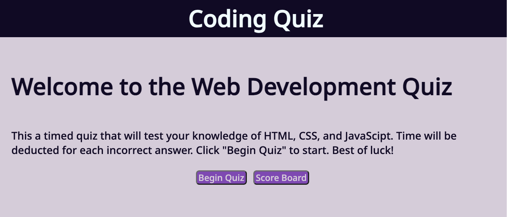
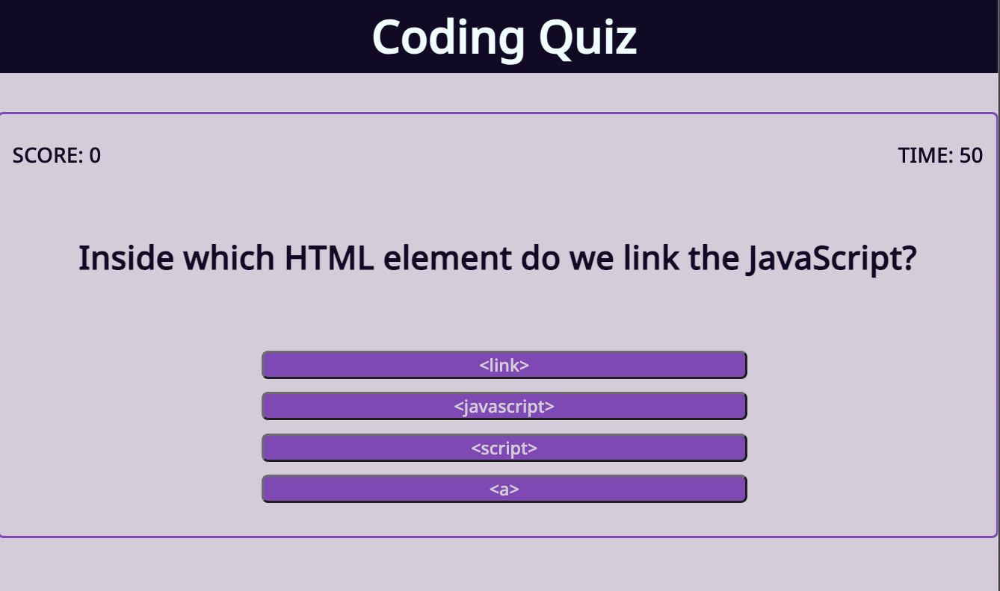
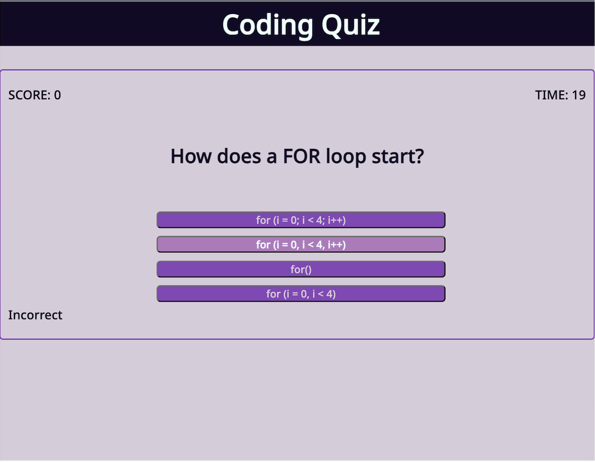
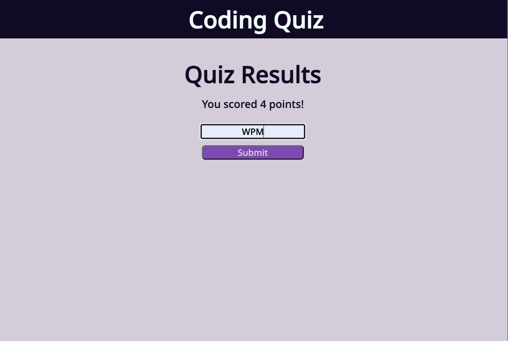
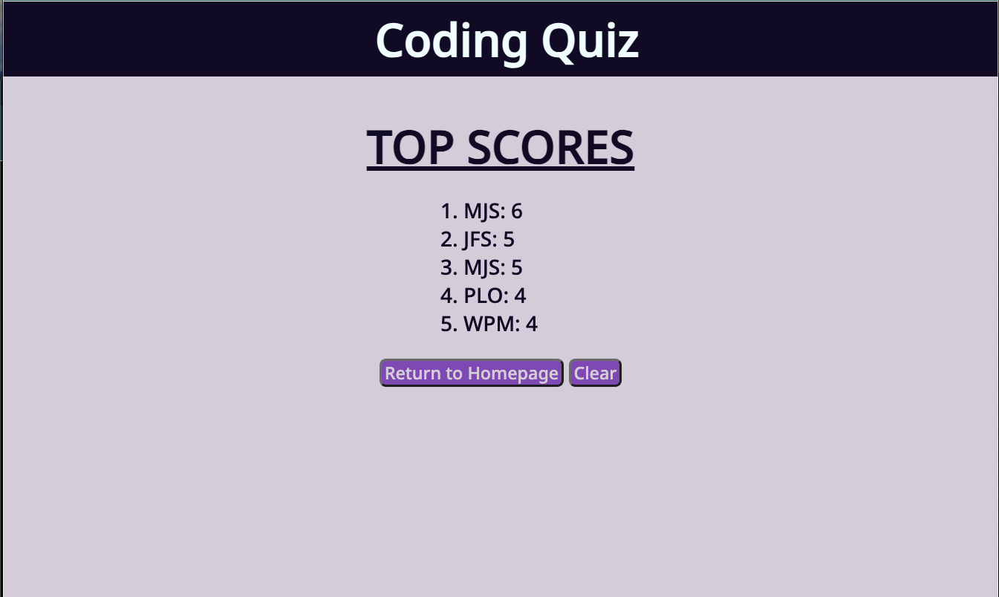

# Code-Quiz

## Description

For this project I created a multiple choice coding quiz webpage.  

    C1. Clicked start button prompts user first question and begins quiz timer
    C2. Another question is prompted, after answering previous question
    C3. If question is answered incorrectly, time is docked from clock
    C4. Game over when all questions are answered or time runs out
    C5. Once Game is over, user can save score along with their initials

Static webpages are not common sites you will see nowadays. Most of today's webpages are dynamic and interactive. Creating this coding quiz webpage was an excellent project to pracitce building and styling modern day websites.    

## Final Product
### Start Page

### Quiz Windows

### Initials Input

### Score Board

## [Take My Code Quiz!](https://margauxjenica.github.io/code-quiz/)